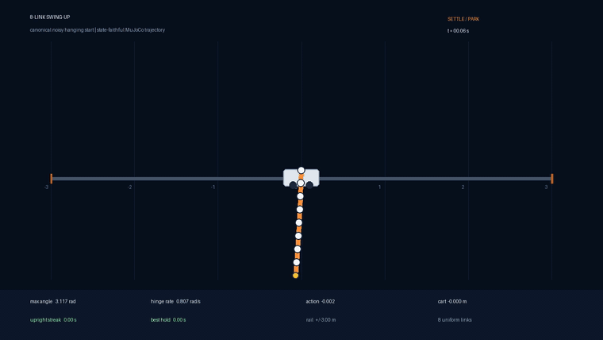

# Nine-, Eight-, and Seven-Link Cart-Pole Swing-Up & Hold

> **Highest verified internal benchmark: 9 links · noisy hanging start · 100/100 successful episodes · zero resets · ±3 m rail**

<p align="center">
  <strong><a href="runs/generalized_solver/nine_link_swingup_success.mp4">Watch the full nine-link run</a></strong>
  · <a href="docs/nine_link_swingup_paper.md">Read the nine-link paper</a>
  · <a href="runs/generalized_solver/nine_link_swingup_manifest.json">Inspect the nine-link manifest</a>
</p>

<p align="center">
  <a href="runs/generalized_solver/eight_link_swingup_success.mp4">
    
  </a>
</p>

<p align="center">
  <strong><a href="runs/generalized_solver/eight_link_swingup_success.mp4">Watch the full eight-link run</a></strong>
  · <a href="docs/eight_link_swingup_paper.md">Read the eight-link paper</a>
  · <a href="runs/generalized_solver/eight_link_swingup_manifest.json">Inspect the eight-link manifest</a>
</p>

> **Frozen seven-link release: noisy hanging start · 100/100 successful episodes · zero resets · ±3 m rail**

<p align="center">
  <a href="runs/swingup7_uniform/seven_link_swingup_success.mp4">
    
  </a>
</p>

<p align="center">
  <strong><a href="runs/swingup7_uniform/seven_link_swingup_success.mp4">Watch the full seven-link run</a></strong>
  · <a href="docs/seven_link_swingup_paper.md">Read the seven-link paper</a>
  · <a href="runs/swingup7_uniform/seven_link_swingup_manifest.json">Inspect the seven-link manifest</a>
</p>

This repository demonstrates reset-free swing-up and sustained hold of uniform
seven-, eight-, and nine-link cart-poles in MuJoCo. Each frozen hybrid controller passed
disjoint `20/20` and `100/100` noisy hanging-start gates on its declared plant.
The videos above are held-out, uninterrupted 30-second replays; click either
animated preview for the source MP4. Controllers, hashes, negative controls,
method papers, and reproduction commands are public.

| Result | Noisy 20-episode gate | Disjoint noisy 100-episode gate | Held-out video | Method |
|---|---:|---:|---|---|
| **9 links — latest internal benchmark** | **20/20** | **100/100** | [MP4](runs/generalized_solver/nine_link_swingup_success.mp4) | [paper](docs/nine_link_swingup_paper.md) |
| **8 links — latest internal benchmark** | **20/20** | **100/100** | [MP4](runs/generalized_solver/eight_link_swingup_success.mp4) | [paper](docs/eight_link_swingup_paper.md) |
| **7 links — frozen release** | **20/20** | **100/100** | [MP4](runs/swingup7_uniform/seven_link_swingup_success.mp4) | [paper](docs/seven_link_swingup_paper.md) |

These are repository benchmark records, not universal world-record claims.
An external record claim requires a matched plant, force convention, rail
geometry, timing, initialization distribution, and independent judging rules.

## The seven-link frozen record

| Benchmark property | Result |
|---|---:|
| Links | **7** |
| 20-episode gate | **20/20 (100%)** |
| 100-episode gate | **100/100 (100%)** |
| Resets inside episodes | **0** |
| Rail failures in the 100-episode gate | **0** |
| First upright | **14.54 s** |
| Upright hold after first upright | **15.48 s** |
| Maximum cart excursion across 100 episodes | **2.3708 m** |

The frozen contract uses a uniform seven-link plant, continuous `±80 N`
force, a `±3 m` rail, 50 Hz control, a noisy hanging start, and a five-second
upright requirement. This is the repository's canonical benchmark record. It
has not yet been certified against an external competition's exact plant and
submission rules, so we do not present it as a universal world-record claim.
See the [fairness notes](docs/yacine_fairness_notes.md) and
[public release checklist](docs/public_release_checklist.md) for that boundary.

## How it works

```text
noisy hanging start
        │
        ▼
10 s hanging-equilibrium LQR conditioning
        │
        ▼
4.56 s Box-FDDP swing route with time-varying feedback
        │
        ▼
terminal LQR capture and upright hold
```

The conditioning phase damps the initial perturbation and recenters the cart
without changing simulator state. A finite-horizon Box-FDDP controller then
executes the swing route, and a terminal LQR takes over only after the chain
arrives quiet enough to hold. The complete explanation—including the state
coordinate bug, the failed approaches, and the decisive robustness changes—is
in **[Seven-Link Cart-Pole Swing-Up: A Settled-Launch Two-Expert Controller](docs/seven_link_swingup_paper.md)**.

## Evidence

| Artifact | What it establishes |
|---|---|
| [Held-out video](runs/swingup7_uniform/seven_link_swingup_success.mp4) | 30-second noisy-start replay, reset-free, all seven links visible |
| [Video metadata](runs/swingup7_uniform/seven_link_swingup_success.video.json) | Seed, runtime, frame count, reset count, final metrics, and hashes |
| [20-episode evaluation](runs/swingup7_uniform/eval_swingup7_20.json) | First canonical acceptance gate: 20/20 |
| [100-episode evaluation](runs/swingup7_uniform/eval_swingup7_100.json) | Final canonical acceptance gate: 100/100 |
| [Robustness sweep](runs/swingup7_uniform/robustness_sweep.json) | Paired-seed stress tests outside the canonical claim boundary |
| [No-settle negative control](runs/eval_swingup7_fddp_two_expert_canonical20.json) | Same noisy-start gate without conditioning: 0/20 |
| [Controller manifest](runs/swingup7_uniform/seven_link_swingup_manifest.json) | Conditioning, swing, capture, switching rules, preprocessing, and hashes |
| [SHA-256 manifest](runs/swingup7_uniform/SHA256SUMS) | Integrity hashes for the complete release bundle |
| [Verification report](runs/swingup7_uniform/verification.json) | Clean-commit benchmark and artifact audit with zero errors |
| [Frozen release controller](runs/swingup7_uniform/seven_link_release_controller.json) | Nominal states, controls, and Box-FDDP feedback gains |
| [Method paper](docs/seven_link_swingup_paper.md) | Benchmark, method, results, limitations, and reproduction |

The stress sweep is deliberately separate from the canonical result. With 20
paired seeds per condition, the frozen controller retained `20/20` success at
initial-noise standard deviations `0.10` and `0.20`, and at an 8-second
conditioning phase; it scored `19/20` with 6 seconds. It failed the tested
force, morphology, damping, sensor-noise, and control-delay perturbations. This
is a strong benchmark result with a narrow plant-and-timing contract, not a
claim of broad robustness.

## The nine-link record extension

The same parked-launch, feedback-route, and delayed-capture architecture now
reaches nine links on the repository's canonical uniform plant. This is the
repository's highest verified internal benchmark, not a claim about an
external competition record:

| Benchmark property | Result |
|---|---:|
| Links | **9** |
| 20-episode noisy gate | **20/20 (100%)** |
| 100-episode noisy gate | **100/100 (100%)** |
| Exact 20-episode check | **20/20 (100%)** |
| Resets inside episodes | **0** |
| Rail failures in the 100-episode gate | **0** |
| First upright in held-out video | **17.84 s** |
| Upright hold through video end | **12.18 s** |
| Maximum cart excursion across 100 noisy episodes | **2.9800 m** |

The nine-link launch parks the hanging cart at `-0.05 m` for `14.0 s`, runs a
`3.94 s` Box-FDDP route with saved time-varying feedback, and hands off to an
upright LQR around the parked cart target. The route's terminal objective
weights absolute angle `20x` and hinge rate `4x`, producing a genuinely quiet
handoff. See the [nine-link method paper](docs/nine_link_swingup_paper.md).

| Artifact | What it establishes |
|---|---|
| [Zoomed-out 30-second video](runs/generalized_solver/nine_link_swingup_success.mp4) | Reset-free noisy hanging-start replay with all nine links visible |
| [Video metadata](runs/generalized_solver/nine_link_swingup_success.video.json) | Held-out seed, zero resets, frame count, hashes, and final metrics |
| [20-episode noisy gate](runs/generalized_solver/n9_fddp_terminal_angle20_parked_target005_20.json) | First nine-link acceptance gate: 20/20 |
| [100-episode noisy gate](runs/generalized_solver/n9_fddp_terminal_angle20_parked_target005_100.json) | Nine-link final statistical gate: 100/100 |
| [Exact 20-episode check](runs/generalized_solver/n9_fddp_terminal_angle20_parked_target005_exact20.json) | Deterministic no-noise replay: 20/20 |
| [Nine-link manifest](runs/generalized_solver/nine_link_swingup_manifest.json) | Frozen phase timings, controller hash, config hash, and evidence links |
| [Nine-link method paper](docs/nine_link_swingup_paper.md) | Method, terminal-angle refinement, negative controls, limitations, and reproduction commands |

## The eight-link record extension

The same two-expert idea reaches eight links on the repository's canonical
uniform plant. This remains a verified internal benchmark, not a claim about
an external competition record:

| Benchmark property | Result |
|---|---:|
| Links | **8** |
| 20-episode noisy gate | **20/20 (100%)** |
| 100-episode noisy gate | **100/100 (100%)** |
| Exact 20-episode check | **20/20 (100%)** |
| Resets inside episodes | **0** |
| Rail failures in the 100-episode gate | **0** |
| First upright in held-out video | **17.80 s** |
| Upright hold through video end | **12.22 s** |
| Maximum cart excursion across 100 noisy episodes | **2.9300 m** |

The eight-link launch parks the hanging cart at `-0.15 m` for `14.0 s`, runs a
`3.94 s` Box-FDDP route with saved time-varying feedback, and hands off to an
upright LQR around the parked cart target. Parking is a controller phase, not
a reset or a changed initial state. See the [eight-link method paper](docs/eight_link_swingup_paper.md).

| Artifact | What it establishes |
|---|---|
| [Zoomed-out 30-second video](runs/generalized_solver/eight_link_swingup_success.mp4) | Reset-free noisy hanging-start replay with all eight links visible |
| [Video metadata](runs/generalized_solver/eight_link_swingup_success.video.json) | Held-out seed, zero resets, frame count, hashes, and final metrics |
| [20-episode noisy gate](runs/generalized_solver/n8_fddp_parked_target015_14s_noisy20.json) | First eight-link acceptance gate: 20/20 |
| [100-episode noisy gate](runs/generalized_solver/n8_fddp_parked_target015_14s_noisy100.json) | Eight-link final statistical gate: 100/100 |
| [Exact 20-episode check](runs/generalized_solver/n8_fddp_parked_target015_14s_exact20.json) | Deterministic no-noise replay: 20/20 |
| [Eight-link manifest](runs/generalized_solver/eight_link_swingup_manifest.json) | Frozen phase timings, controller hash, config hash, and evidence links |
| [Eight-link SHA-256 manifest](runs/generalized_solver/SHA256SUMS) | Integrity hashes for the route, gates, video, and manifest |
| [Eight-link method paper](docs/eight_link_swingup_paper.md) | Method, negative controls, limitations, and reproduction commands |

## Generalized solver ladder (development)

Separate from the frozen seven-link record, the repository now includes a
bottom-up, morphology-aware solver track. It starts at one link, promotes a
controller only after an uninterrupted noisy gate, then uses that accepted
route to initialize the next link count. The deterministic layer supplies
dimensionless scaling, exact mass-matrix partial feedback linearization,
arc-length state/feedback transfer, Box-FDDP refinement, Riccati capture, and
exact left/right symmetry. The thin online layer consists of exact-model route
selection plus bounded action-direction system identification; neither learns
the swing trajectory.

| Uniform chain | Current gate | Body-aware required rail ratio |
|---:|---:|---:|
| 1 link | **20/20** through shared evaluator | 0.951 |
| 2 links | **20/20** | 1.013 |
| 3 links | **20/20** | 1.001 |
| 4 links | **20/20** | 0.995 |
| 5 links | **20/20** | 1.171 |
| 6 links | **20/20** | 1.093 |
| 7 links | **20/20** through shared evaluator; canonical release is **100/100** | 0.850 |
| 8 links | Separate parked-launch release is **100/100** | 1.037 |
| 9 links | Separate parked-launch release is **100/100** | 1.053 |

These are development results, not additions to the public seven-link record
claim. See the [generalized solver design and honest frontier](docs/generalized_solver.md),
including why total chain energy and one aggregate phase variable stop being
sufficient as internal modes appear. Rail length is solved jointly with the
route: n=5 needed a 4.5 m half-rail for its tested controller, while the new
n=6 route passed on a 4.0 m half-rail and measured a 1.093 body-aware ratio.
For n=6, a morphology-derived modal seed, bounded exact-model residual search,
full-rank endpoint Gauss--Newton correction, Box-FDDP feedback, Riccati
capture, and exact planar mirror passed all 20 uninterrupted noisy episodes.
The n=7 row reuses the frozen record controller through this shared evaluator;
it does not claim that the new modal synthesis has independently regenerated
the record route. The n=8 row is the separate parked-launch promotion and its
`1.037` body-aware ratio is `(2.9300 m + 0.18 m) / 3 m`; the n=9 row is the
same parked-launch promotion with a `1.053` body-aware ratio from the noisy
100-episode maximum. Neither is an independent modal-synthesis regeneration.
Arbitrary unequal morphologies and n>=10 remain active work.

The n=1 rung now uses the same saved-route, exact mirror, forward-model
selection, bounded-action execution, LQR capture, and uninterrupted noisy gate
interface as n=2 through n=7. Its analytic energy controller acts only as a
deterministic route teacher. A hash-bound verifier checks all controller
dimensions and action bounds, exact symmetry, selector predictions, rail
measurements, unique seeds, and uninterrupted outcomes: the shared contract is
currently **140/140** with prediction matching execution in all **140/140**
episodes. See the [verified uniform ladder](runs/generalized_solver/uniform_ladder_n1_n7.json)
and [n=1 shared-evaluator gate](runs/generalized_solver/n1_gate_20_shared.json).
This verifies one execution architecture, not one unchanged force trace or one
route-synthesis primitive for every morphology.

The count-agnostic locked-split continuation has also crossed its deliberately
hard n=2 to unequal-n=3 topology boundary. Direct equality relaxation reached
`p=0.99954875` but rejected the discontinuous endpoint. A deterministic
dimensionless support ladder then completed from `kappa=1`, `d=0.01` to
`kappa=10`, `d=0.1`; at that support the equality was removed completely and
the exact nonlinear replay held upright for `19.38 s` with `4.507433 m` peak
cart travel. This is a fully unlocked three-link topology, but it is still a
physically supported plant—not the unsupported target.

Support removal is now measured on two declared paths. Coupled spring/damping
relaxation has an exact-pass frontier at `p=0.966604614` (hold `20.52 s`), while
the more stable axis-separated schedule removed `99.375%` of spring stiffness
at fixed damping and held for `19.96 s` with `3.917783 m` peak cart travel.
The zero-stiffness endpoint remains rejected, so damping removal and the final
unsupported noisy gate have not started. Here `p` is only a homotopy coordinate,
not percent completion of the general-solver task. See the
[compact hash-bound support frontier](runs/generalized_solver/supported_unlock_frontier.json),
which publishes the final accepted and nearest rejected checkpoints without
shipping hundreds of megabytes of optimizer scratch history.

The capture gate is also now actuator-aware. On freshly replayed handoffs from
the proven n=7, n=8, and n=9 routes, the same exact five-second saturated-LQR
audit used zero saturated steps and completed the requested hold. The current
n=10 terminal-arrival proposal is a useful negative control: its raw feedback
demand is `738.673` for an actuator limited to `1`, and the minimum stabilizing
gain scale is about `699.4x` larger than the maximum initially nonsaturating
scale. It saturates continuously and hits the rail after `1.04 s`. This tells
the next deterministic optimizer to reshape the arrival into the feasible
capture set rather than merely shrinking the LQR gain. An exact logarithmic
ray scan now quantifies that target: this particular arrival direction first
fails at `1.91994e-5` of its current error, so its origin-connected five-second
capture interval is roughly `52,085x` smaller than the proposed error vector.
This is a directional basin measurement, not a global basin certificate. The
same audit now emits an optimizer-ready linear-feedback residual over one
natural time: it predicts zero saturated steps for n=7 through n=9, but all
`28/28` steps saturated for this n=10 arrival. See the
[n=7 audit](runs/generalized_solver/n7_release_actual_handoff_capture_geometry.json),
[n=8 audit](runs/generalized_solver/n8_release_actual_handoff_capture_geometry.json),
[n=9 audit](runs/generalized_solver/n9_release_actual_handoff_capture_geometry.json),
[n=10 negative control](runs/generalized_solver/n10_centered_terminal8_capture_geometry.json), and
[generalized solver notes](docs/generalized_solver.md).

The same bounded actuator adapter has also passed a paired development check at
every rung. A hidden map `delivered = 1.18 * commanded + 0.06` broke all 21
unadapted trials, while four seconds of deterministic calibration followed by
a frozen gain/bias estimate recovered **21/21** trials. Controller routes and
energy parameters were unchanged, the largest action correction was `0.204`
against a hard `0.35` bound, and the largest fitted-parameter error was
`0.0026`. See the [verified adaptation ladder](runs/generalized_solver/adaptation_ladder_n1_n7.json).
This is a deliberately small, fully compensable actuator diagnostic—not proof
of arbitrary morphology robustness. Lost force authority at saturation and
residuals outside the modeled action direction still require replanning.

The first unequal-morphology promotion now exercises that replan path. For a
two-link chain with lengths `[1.2, 1.8] m` and masses `[0.35, 0.65] kg`, direct
arc-length transfer scored **0/5**. Refining the transferred route on the exact
measured plant with the same Box-FDDP, Riccati-capture, and mirror architecture
then passed **20/20** noisy uninterrupted episodes, with prediction matching
execution on all 20. Its maximum body-aware required rail ratio was `1.193` on
the declared `1.5` configured ratio. The [verified unequal-morphology artifact](runs/generalized_solver/n2_unequal_frontier.json)
keeps this result separate from the uniform ladder and explicitly limits the
claim to this one plant. A new parameterized pipeline command now performs the
whole transfer -> exact-target refinement -> mirror -> noisy-gate -> verifier
sequence from source controller and target morphology files; it contains no
link-count branch or per-count controller constants.

The next deliberately stronger three-link target is still unsolved at full
strength. Its lengths `[0.75, 1.0, 1.25] m` and masses `[0.2, 0.3, 0.5] kg`
caused direct transfer and direct exact refinement to fail, so the one-shot
pipeline correctly stops before promotion. See the
[one-command n=3 negative frontier](runs/generalized_solver/n3_unequal_pipeline.json).
The uniform n=3 gate above remains valid. Deterministic continuation now
repairs nearby routes through adaptive exact-model waypoint horizons before the
full-horizon feedback pass. When the original `0.48 s` horizon hit a trajectory
branch wall, the same generic driver automatically tried `0.96 s` and `1.92 s`
lookahead rather than adding a per-morphology controller. The curated n=3
checkpoint has now advanced the strong-morphology path from `p=0.02500` to
`p=0.0360234`; its exact hanging replay held upright for `18.78 s`. The
analytic route pair alone passed **19/20**, leaving one start outside both
immediate-launch basins. The new bounded selector tests the pair over a fixed
grid of hanging-LQR durations expressed in morphology natural-time units and
executes the shortest predicted success. It then passed **20/20** and a
disjoint **100/100**, with prediction matching execution every time. Of the
100 episodes, 99 launched immediately and one used only the first `0.25 tau`
rung; maximum required rail ratio was `1.369`. The selector uses zero learned
parameters and no link-count constants. A 50-trial continuation ledger contains
27 accepted and 23 rejected proposals; every rejected final replay hit the
rail, exposing rail length as an active continuation coordinate rather than a
link-count constant. The joint driver has now advanced exact replay to
`p=0.0362145` on the original rail, with an `18.78 s` hold and a measured
body-aware rail ratio of `1.593`. This newest point is exact-only development
evidence. The earlier `p=0.0360548` route passed a fresh **20/20** cohort but
scored **96/100** on the disjoint larger gate; all four failures were predicted
by the exact selector and ended at the rail. It is therefore retained as a
negative robustness boundary, while `p=0.0360234` remains the robust
**100/100** checkpoint. A new normalized-clearance guard also stops rail
expansion when a failed optimizer merely follows the wider boundary outward;
that case now shrinks the morphology step instead of being misclassified as a
physical rail requirement. This is a verified partial-morphology frontier, not
a solution of the `p=1` target. See the
[adaptive checkpoint](runs/generalized_solver/n3_unequal_adaptive_checkpoint.json),
[packaged route](runs/generalized_solver/n3_unequal_p036023_route.json), and
[100-episode adaptive gate](runs/generalized_solver/n3_unequal_p036023_adaptive100.json).
The [measured morphology/rail frontier](runs/generalized_solver/n3_unequal_rail_frontier.json)
keeps successful route requirements separate from failed-controller excursions.
The resumable
[`run_joint_morphology_rail_homotopy.py`](scripts/run_joint_morphology_rail_homotopy.py)
expands rail only after a measured rail collision, continues morphology, then
contracts rail toward the requested target; expanded-rail passes remain
development evidence until the final target-rail replay succeeds.
The newer [exact route](runs/generalized_solver/n3_unequal_p036055_route.json),
[20-episode pass](runs/generalized_solver/n3_unequal_p036055_adaptive20.json),
and [96/100 negative gate](runs/generalized_solver/n3_unequal_p036055_adaptive100.json)
make that promotion boundary inspectable. The newer
[`p=0.0362145` exact-only route](runs/generalized_solver/n3_unequal_p036214_route.json)
and [exact replay](runs/generalized_solver/n3_unequal_p036214_exact1.json) keep
the continuing deterministic frontier separate from the robust claim.

## Next frontier: ten links

Nine links has passed the repository's internal evidence bundle. The next
active frontier is **ten links**, and it must use the same discipline: start
hanging, apply the settled-cart launch, swing with saved feedback, capture in
the same episode, and pass fresh 20/100 noisy gates on the canonical rail.
The earlier nine-link transfer, tail-search, and locked-link artifacts remain
preserved as negative controls in the experiment ledger.

- [`configs/swingup9_uniform.yaml`](configs/swingup9_uniform.yaml)
- [`runs/generalized_solver/n9_fddp_terminal_angle20_widerail.json`](runs/generalized_solver/n9_fddp_terminal_angle20_widerail.json)
- [`runs/generalized_solver/nine_link_swingup_manifest.json`](runs/generalized_solver/nine_link_swingup_manifest.json)
- [`ROADMAP.md`](ROADMAP.md)

The project advances one link only after the same evidence bundle passes. No
ten-link result is claimed yet.

## Reproduce the result

Requirements: Python 3.10+, MuJoCo, and a local environment capable of running
Crocoddyl/Box-FDDP. The recorded setup targets Apple Silicon; see
[`requirements-fddp.txt`](requirements-fddp.txt) and
[`scripts/setup_aligator.sh`](scripts/setup_aligator.sh) for the planner stack.

```bash
git clone https://github.com/corbensorenson/cartpole.git
cd cartpole

make setup-aligator
make release-swingup7

# Verify the published internal nine-link controller, gates, video, and manifest.
cd runs/generalized_solver
shasum -a 256 -c SHA256SUMS
```

`release-swingup7` regenerates two disjoint evaluation cohorts, the independent
video, the non-canonical robustness sweep, checksums, and the final verifier
report. It intentionally refuses to run when tracked source files are dirty.
For individual replay commands and the evidence contract, follow the
[seven-link paper's reproduction section](docs/seven_link_swingup_paper.md#6-reproduction).
The [eight-link reproduction section](docs/eight_link_swingup_paper.md#6-reproduction)
contains the exact parked-launch evaluation and rendering commands.
The [nine-link reproduction section](docs/nine_link_swingup_paper.md#6-reproduction)
contains the current frontier's exact commands and terminal-angle settings.

## Repository map

| Path | Purpose |
|---|---|
| [`src/gcartpole`](src/gcartpole) | MuJoCo environment, controllers, optimizers, and evidence code |
| [`configs`](configs) | Frozen benchmark and curriculum configurations |
| [`scripts`](scripts) | Training, search, evaluation, replay, and rendering entry points |
| [`tests`](tests) | Dynamics, optimizer, morphology, and evidence-contract tests |
| [`docs`](docs) | Paper, roadmap support, experiment ledger, and reproduction notes |
| [`runs/generalized_solver`](runs/generalized_solver) | Curated n=1..9 gates, routes, videos, and honest frontier records |
| [`runs/swingup7_uniform`](runs/swingup7_uniform) | Curated public seven-link evidence bundle |

Research history is intentionally preserved, including negative results. Start
with the [method paper](docs/seven_link_swingup_paper.md) for the clean narrative
and [`docs/levers_and_pitfalls.md`](docs/levers_and_pitfalls.md) for the full
experiment ledger.
