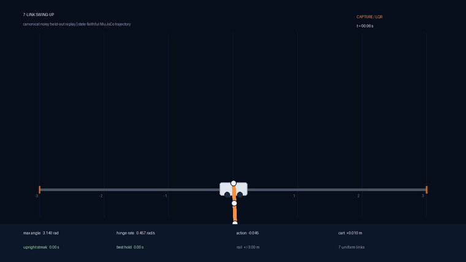

# Seven- and Eight-Link Cart-Pole Swing-Up & Hold

> **7 links · noisy hanging start · 100/100 successful episodes · zero resets · ±3 m rail**

<p align="center">
  <a href="runs/swingup7_uniform/seven_link_swingup_success.mp4">
    
  </a>
</p>

<p align="center">
  <strong><a href="runs/swingup7_uniform/seven_link_swingup_success.mp4">Watch the full 30-second run</a></strong>
  · <a href="docs/seven_link_swingup_paper.md">Read the method paper</a>
  · <a href="runs/swingup7_uniform/seven_link_swingup_manifest.json">Inspect the controller manifest</a>
</p>

This repository demonstrates a reset-free swing-up and sustained hold of a
uniform seven-link cart-pole in MuJoCo. One frozen hybrid controller passed
both held-out gates—`20/20` and `100/100`—from the declared noisy hanging-start
distribution. The full evidence bundle, controller hashes, negative controls,
and reproduction commands are public.

## The seven-link record

| Benchmark property | Result |
|---|---:|
| Links | **7** |
| 20-episode gate | **20/20 (100%)** |
| 100-episode gate | **100/100 (100%)** |
| Resets inside episodes | **0** |
| Rail failures in the 100-episode gate | **0** |
| First upright | **14.54 s** |
| Upright hold after first upright | **15.48 s** |
| Maximum cart excursion across 100 episodes | **2.3708 m** |

The frozen contract uses a uniform seven-link plant, continuous `±80 N`
force, a `±3 m` rail, 50 Hz control, a noisy hanging start, and a five-second
upright requirement. This is the repository's canonical benchmark record. It
has not yet been certified against an external competition's exact plant and
submission rules, so we do not present it as a universal world-record claim.
See the [fairness notes](docs/yacine_fairness_notes.md) and
[public release checklist](docs/public_release_checklist.md) for that boundary.

## How it works

```text
noisy hanging start
        │
        ▼
10 s hanging-equilibrium LQR conditioning
        │
        ▼
4.56 s Box-FDDP swing route with time-varying feedback
        │
        ▼
terminal LQR capture and upright hold
```

The conditioning phase damps the initial perturbation and recenters the cart
without changing simulator state. A finite-horizon Box-FDDP controller then
executes the swing route, and a terminal LQR takes over only after the chain
arrives quiet enough to hold. The complete explanation—including the state
coordinate bug, the failed approaches, and the decisive robustness changes—is
in **[Seven-Link Cart-Pole Swing-Up: A Settled-Launch Two-Expert Controller](docs/seven_link_swingup_paper.md)**.

## Evidence

| Artifact | What it establishes |
|---|---|
| [Held-out video](runs/swingup7_uniform/seven_link_swingup_success.mp4) | 30-second noisy-start replay, reset-free, all seven links visible |
| [Video metadata](runs/swingup7_uniform/seven_link_swingup_success.video.json) | Seed, runtime, frame count, reset count, final metrics, and hashes |
| [20-episode evaluation](runs/swingup7_uniform/eval_swingup7_20.json) | First canonical acceptance gate: 20/20 |
| [100-episode evaluation](runs/swingup7_uniform/eval_swingup7_100.json) | Final canonical acceptance gate: 100/100 |
| [Robustness sweep](runs/swingup7_uniform/robustness_sweep.json) | Paired-seed stress tests outside the canonical claim boundary |
| [No-settle negative control](runs/eval_swingup7_fddp_two_expert_canonical20.json) | Same noisy-start gate without conditioning: 0/20 |
| [Controller manifest](runs/swingup7_uniform/seven_link_swingup_manifest.json) | Conditioning, swing, capture, switching rules, preprocessing, and hashes |
| [SHA-256 manifest](runs/swingup7_uniform/SHA256SUMS) | Integrity hashes for the complete release bundle |
| [Verification report](runs/swingup7_uniform/verification.json) | Clean-commit benchmark and artifact audit with zero errors |
| [Frozen release controller](runs/swingup7_uniform/seven_link_release_controller.json) | Nominal states, controls, and Box-FDDP feedback gains |
| [Method paper](docs/seven_link_swingup_paper.md) | Benchmark, method, results, limitations, and reproduction |

The stress sweep is deliberately separate from the canonical result. With 20
paired seeds per condition, the frozen controller retained `20/20` success at
initial-noise standard deviations `0.10` and `0.20`, and at an 8-second
conditioning phase; it scored `19/20` with 6 seconds. It failed the tested
force, morphology, damping, sensor-noise, and control-delay perturbations. This
is a strong benchmark result with a narrow plant-and-timing contract, not a
claim of broad robustness.

## The eight-link extension

The same two-expert idea now reaches eight links on the repository's canonical
uniform plant. This is an internal eight-link benchmark promotion, not a claim
about an external competition record:

| Benchmark property | Result |
|---|---:|
| Links | **8** |
| 20-episode noisy gate | **20/20 (100%)** |
| 100-episode noisy gate | **100/100 (100%)** |
| Exact 20-episode check | **20/20 (100%)** |
| Resets inside episodes | **0** |
| Rail failures in the 100-episode gate | **0** |
| First upright in held-out video | **17.80 s** |
| Upright hold through video end | **12.22 s** |
| Maximum cart excursion across 100 noisy episodes | **2.9300 m** |

The eight-link launch parks the hanging cart at `-0.15 m` for `14.0 s`, runs a
`3.94 s` Box-FDDP route with saved time-varying feedback, and hands off to an
upright LQR around the parked cart target. Parking is a controller phase, not
a reset or a changed initial state. See the [eight-link method paper](docs/eight_link_swingup_paper.md).

| Artifact | What it establishes |
|---|---|
| [Zoomed-out 30-second video](runs/generalized_solver/eight_link_swingup_success.mp4) | Reset-free noisy hanging-start replay with all eight links visible |
| [Video metadata](runs/generalized_solver/eight_link_swingup_success.video.json) | Held-out seed, zero resets, frame count, hashes, and final metrics |
| [20-episode noisy gate](runs/generalized_solver/n8_fddp_parked_target015_14s_noisy20.json) | First eight-link acceptance gate: 20/20 |
| [100-episode noisy gate](runs/generalized_solver/n8_fddp_parked_target015_14s_noisy100.json) | Eight-link final statistical gate: 100/100 |
| [Exact 20-episode check](runs/generalized_solver/n8_fddp_parked_target015_14s_exact20.json) | Deterministic no-noise replay: 20/20 |
| [Eight-link manifest](runs/generalized_solver/eight_link_swingup_manifest.json) | Frozen phase timings, controller hash, config hash, and evidence links |
| [Eight-link SHA-256 manifest](runs/generalized_solver/SHA256SUMS) | Integrity hashes for the route, gates, video, and manifest |
| [Eight-link method paper](docs/eight_link_swingup_paper.md) | Method, negative controls, limitations, and reproduction commands |

## Generalized solver ladder (development)

Separate from the frozen seven-link record, the repository now includes a
bottom-up, morphology-aware solver track. It starts at one link, promotes a
controller only after an uninterrupted noisy gate, then uses that accepted
route to initialize the next link count. The deterministic layer supplies
dimensionless scaling, exact mass-matrix partial feedback linearization,
arc-length state/feedback transfer, Box-FDDP refinement, Riccati capture, and
exact left/right symmetry. The thin online layer consists of exact-model route
selection plus bounded action-direction system identification; neither learns
the swing trajectory.

| Uniform chain | Current gate | Body-aware required rail ratio |
|---:|---:|---:|
| 1 link | **20/20** | 0.959 |
| 2 links | **20/20** | 1.013 |
| 3 links | **20/20** | 1.001 |
| 4 links | **20/20** | 0.995 |
| 5 links | **20/20** | 1.171 |
| 6 links | **20/20** | 1.093 |
| 7 links | **20/20** through shared evaluator; canonical release is **100/100** | 0.850 |

These are development results, not additions to the public seven-link record
claim. See the [generalized solver design and honest frontier](docs/generalized_solver.md),
including why total chain energy and one aggregate phase variable stop being
sufficient as internal modes appear. Rail length is solved jointly with the
route: n=5 needed a 4.5 m half-rail for its tested controller, while the new
n=6 route passed on a 4.0 m half-rail and measured a 1.093 body-aware ratio.
For n=6, a morphology-derived modal seed, bounded exact-model residual search,
full-rank endpoint Gauss--Newton correction, Box-FDDP feedback, Riccati
capture, and exact planar mirror passed all 20 uninterrupted noisy episodes.
The n=7 row reuses the frozen record controller through this shared evaluator;
it does not claim that the new modal synthesis has independently regenerated
the record route. The eight-link result is a separate parked-launch promotion;
arbitrary unequal morphologies and n>=9 remain active work.

The same bounded actuator adapter has also passed a paired development check at
every rung. A hidden map `delivered = 1.18 * commanded + 0.06` broke all 21
unadapted trials, while four seconds of deterministic calibration followed by
a frozen gain/bias estimate recovered **21/21** trials. Controller routes and
energy parameters were unchanged, the largest action correction was `0.204`
against a hard `0.35` bound, and the largest fitted-parameter error was
`0.0026`. See the [verified adaptation ladder](runs/generalized_solver/adaptation_ladder_n1_n7.json).
This is a deliberately small, fully compensable actuator diagnostic—not proof
of arbitrary morphology robustness. Lost force authority at saturation and
residuals outside the modeled action direction still require replanning.

The first unequal-morphology promotion now exercises that replan path. For a
two-link chain with lengths `[1.2, 1.8] m` and masses `[0.35, 0.65] kg`, direct
arc-length transfer scored **0/5**. Refining the transferred route on the exact
measured plant with the same Box-FDDP, Riccati-capture, and mirror architecture
then passed **20/20** noisy uninterrupted episodes, with prediction matching
execution on all 20. Its maximum body-aware required rail ratio was `1.193` on
the declared `1.5` configured ratio. The [verified unequal-morphology artifact](runs/generalized_solver/n2_unequal_frontier.json)
keeps this result separate from the uniform ladder and explicitly limits the
claim to this one plant. A new parameterized pipeline command now performs the
whole transfer -> exact-target refinement -> mirror -> noisy-gate -> verifier
sequence from source controller and target morphology files; it contains no
link-count branch or per-count controller constants.

The next deliberately stronger three-link target is published as a negative
frontier, not a success. Its lengths `[0.75, 1.0, 1.25] m` and masses
`[0.2, 0.3, 0.5] kg` caused direct transfer and direct exact refinement to
fail, so the pipeline stops before promotion. See the
[one-command n=3 frontier](runs/generalized_solver/n3_unequal_pipeline.json).
This is the current boundary for arbitrary within-count morphology transfer;
the uniform n=3 gate above remains valid. The deterministic continuation now
repairs nearby routes through short exact-model waypoint solves before the
full-horizon feedback pass. Its first curated n=3 checkpoint advanced the
strong-morphology path from `p=0.02500` to `p=0.02525` and held upright for
`18.80 s`; [the manifest](runs/generalized_solver/n3_unequal_waypoint_homotopy/continuation.json)
labels this as partial continuation, not a solution of the `p=1` target.

## Next frontier: nine links

Eight links has passed the repository's internal evidence bundle. The next
active frontier is **nine links**, and it must use the same discipline: start
hanging, apply the settled-cart launch, swing with saved feedback, capture in
the same episode, and pass fresh 20/100 noisy gates on the canonical rail.
The earlier eight-link modal, open-loop, online-MPC, and wide-rail artifacts
remain preserved as negative controls in the experiment ledger.

- [`configs/swingup8_uniform.yaml`](configs/swingup8_uniform.yaml)
- [`runs/generalized_solver/n8_capture_fddp_feedback120.json`](runs/generalized_solver/n8_capture_fddp_feedback120.json)
- [`ROADMAP.md`](ROADMAP.md)

The project advances one link only after the same evidence bundle passes. No
nine-link result is claimed yet.

## Reproduce the result

Requirements: Python 3.10+, MuJoCo, and a local environment capable of running
Crocoddyl/Box-FDDP. The recorded setup targets Apple Silicon; see
[`requirements-fddp.txt`](requirements-fddp.txt) and
[`scripts/setup_aligator.sh`](scripts/setup_aligator.sh) for the planner stack.

```bash
git clone https://github.com/corbensorenson/cartpole.git
cd cartpole

make setup-aligator
make release-swingup7
```

`release-swingup7` regenerates two disjoint evaluation cohorts, the independent
video, the non-canonical robustness sweep, checksums, and the final verifier
report. It intentionally refuses to run when tracked source files are dirty.
For individual replay commands and the evidence contract, follow the
[paper's reproduction section](docs/seven_link_swingup_paper.md#6-reproduction).

## Repository map

| Path | Purpose |
|---|---|
| [`src/gcartpole`](src/gcartpole) | MuJoCo environment, controllers, optimizers, and evidence code |
| [`configs`](configs) | Frozen benchmark and curriculum configurations |
| [`scripts`](scripts) | Training, search, evaluation, replay, and rendering entry points |
| [`tests`](tests) | Dynamics, optimizer, morphology, and evidence-contract tests |
| [`docs`](docs) | Paper, roadmap support, experiment ledger, and reproduction notes |
| [`runs/generalized_solver`](runs/generalized_solver) | Curated n=1..8 gates, routes, videos, and honest frontier records |
| [`runs/swingup7_uniform`](runs/swingup7_uniform) | Curated public seven-link evidence bundle |

Research history is intentionally preserved, including negative results. Start
with the [method paper](docs/seven_link_swingup_paper.md) for the clean narrative
and [`docs/levers_and_pitfalls.md`](docs/levers_and_pitfalls.md) for the full
experiment ledger.
