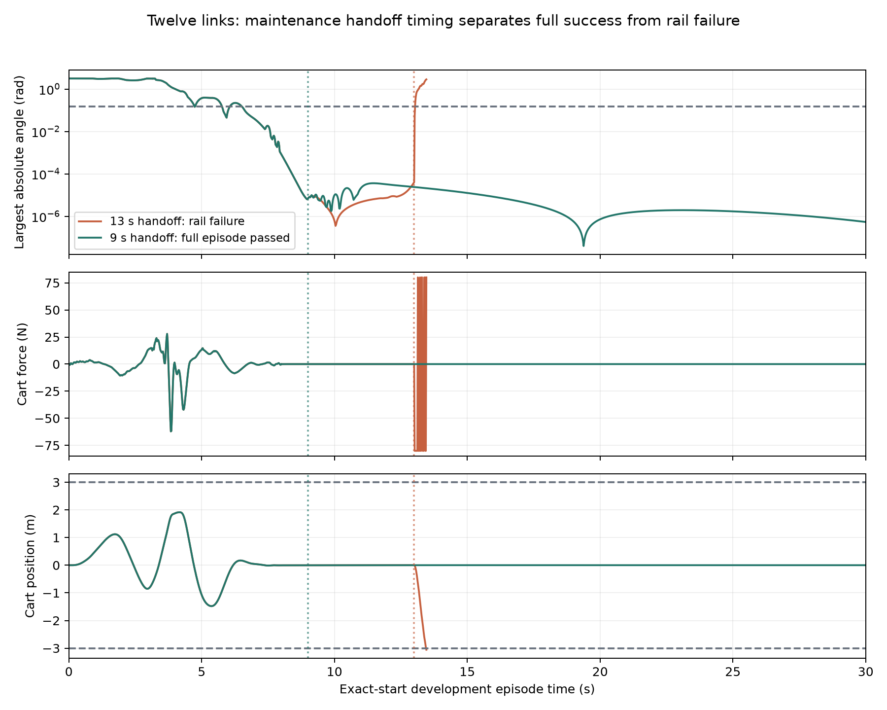

# Twelve-link canonical swing-up and sustained hold

On October 2, 2026, twelve uniform passive serial links passed the complete
internal canonical release bundle from frozen source commit
`f24c66ce849881e37252dcab0ca9a8633f672c34`.

| Reserved cohort | Result | Minimum upright hold | Maximum cart excursion |
|---|---:|---:|---:|
| Noisy 20 | 20/20 | 7.50 s | 1.863869 m |
| Disjoint noisy 100 | 100/100 | 7.50 s | 1.863891 m |
| Exact 20 | 20/20 | 7.50 s | 1.863863 m |
| Held-out video | 1/1 | 7.50 s | 1.863846 m |

Every episode completes all 1500 control steps without rail failure or
mid-episode state replacement. The plant remains 3 m total chain length,
1 kg total chain mass, 1 kg cart, ±80 N force, ±3 m rail, 0.005 s RK4
physics and 50 Hz control. This is an internal benchmark promotion.

The policy contracts the noisy hanging chain for 16 s with cart weights
10/5 and control penalty 1000 around target -0.05 m, tracks a physically
rebuilt nine-second feedback swing, then uses an 80-digit-designed upright
LQR. Nonlinear MuJoCo execution and delivered float32 actions retain the
canonical precision. All accepted episodes hold upright for 7.50 s.

[Full thirty-second video](../runs/swingup12_uniform/twelve_link_swingup_success.mp4),
[manifest](../runs/swingup12_uniform/twelve_link_swingup_manifest.json),
[clean source bundle](../runs/swingup12_uniform/twelve_link_source.bundle).

## Reproduction

Clone the source bundle and use its recorded dependency versions. Recorded
reserved commands in `runs/swingup12_uniform/reserved_commands.json` were
executed from that fresh clone, with evaluation outputs saved outside the
clone. Adjust the interpreter/output paths for your machine. On macOS,
exclude Finder `.DS_Store` metadata through `.git/info/exclude` if necessary;
do not change the frozen policy or tracked source.

The complete package passes `scripts/verify_frontier_release.py`; 103
focused checks pass in the frozen source clone and all 374 tests pass in
the publication worktree. The source bundle reproduces policy evaluation;
`twelve_link_synthesis_inputs.tar.gz` separately preserves the exact source,
initialization files and wrapper commands for the decisive synthesis,
handoff and physical rebuild. The optimizer's full output and comparison
plots are included. The experiment ledger retains earlier negative branches.
The first reserved attempt passed physically but was rejected for an
untracked Finder file; it was preserved and every identical cohort was
rerun without tuning. No cohort is counted twice.

## Development chronology and claim scope

The following note was written before promotion. Its pending-release wording
records that historical stage; the frozen manifest above governs the current
accepted result. Generalist re-synthesis across unseen counts/morphologies,
hardware transfer, sensor noise and delay remain separate research tests.

# Twelve-link development evidence

Twelve now has successful full exact-start development episodes at the
canonical 50 Hz control rate. Reserved release validation is still pending.
The eleven-link release remains the accepted frontier until twelve completes
the same frozen-source, noisy-cohort, exact-cohort and video gates.

## Procedure and the recovered failure

The architecture remains hanging contraction, an optimized feedback swing,
then upright maintenance. Twelve required a residual-form sparse sequential
convexification step on the full horizon, followed by an earlier maintenance
handoff. This is an extension of the shared synthesis procedure, with
count-specific trajectories and gains as outputs. Automatic re-synthesis
across counts and generalization to new morphologies remain separate claims.

The initializer combines an eight-second physical hanging-to-near-upright
route with a five-second virtual upright tail. Offline multiple-shooting
nodes are explicit optimizer variables. They are never imposed on the live
plant. Simultaneous state/control increments, L1 virtual-dynamics penalties,
hard cart bounds, hard virtual capture-angle bounds, and explicit quadratic
residual variables avoid forming the ill-conditioned cost Gram matrix.
Every accepted candidate must decrease the actual nonlinear merit and retain
the hard virtual-node bounds. The full physical episode is measured
independently. Native QP status does not certify physical capture.

The matched suffix-only variants freeze six seconds of the source. Strict
1e-8 native QP tolerances accept no step within the prescribed budgets.
Adaptive tolerances accept full updates; a separately marked inexact-QP
candidate decreases actual merit further. The largest physical defect falls
from 0.001757417 to 0.00000596958, but the actual hold is only 0.28 seconds.
Smaller gaps alone therefore do not establish a usable trajectory.

Allowing the entire thirteen-second horizon to change accepts thirteen
updates in twenty outer iterations. The final maximum local physical defect
is 9.93866e-8, and the total scaled L1 defect is 1.64592e-5. Search takes
983.09 seconds on the recorded runtime. Its QPs have 69,603 variables and
89,515 constraint rows, with at most 10,000 native iterations per outer step.
The actual hanging-start episode holds upright for 6.52 seconds, then hits
the rail at 13.46 seconds. It is a negative full-episode result.

The failure occurs as the route ends. At thirteen seconds the final tracking
gain norm has fallen to 1.655; the physical state looks geometrically close
to upright but its directional capture value is about 7.18e7. Switching to
the upright regulator immediately saturates the force. Earlier handoffs at
8, 9, 10, 11 and 12 seconds all pass the full exact-start episode, with
23.50 seconds upright and maximum cart excursion 1.913864 m. The saved
prefixes, feedback and physical states are unchanged through each handoff.
This identifies a concrete endpoint problem: waiting for the last planned
node can let a weakly controlled direction leave viable capture.

The nine-second handoff was selected before the corrected eight-second
replay completed. The first eight-second attempt was an argument-validation
failure because its unused capture objective began at the route endpoint.
The corrected replay removes that unused objective; it retains the same
physical prefix and gains. All attempts and the selection order are saved.

The successful nine-second route is rebuilt offline by serial feedback
execution, storing delivered float32 actions and actual physical nodes.
The rebuilt route has exactly zero checked dynamics gaps and independently
reproduces every physical state of the successful thirty-second episode.
This turns the optimizer output into a physically consistent controller
artifact suitable for the existing evaluator.

## Development validation and negative controls

The unreconstructed nine-second candidate passes a fresh twenty-seed noisy
development cohort after sixteen seconds of hanging regulation. The rebuilt
candidate is tested separately because its references and delivered controls
have changed. Hanging cart-position/velocity weights remain 10/5, control
penalty 1000, translated target -0.05 m, and tracking scale one. Every
episode runs continuously from its noisy hanging reset without state
replacement at the phase transitions. These are development cohorts;
reserved seeds remain separate until policy/source freezing.

Pure tracking feedback designed independently of the optimizer's clipped
descent step does not rescue the suffix-only route: both regularization zero
and 625 hold for 0.28 seconds. Applying regularization-zero pure tracking to
the full-horizon route worsens its hold to 1.34 seconds. The successful
candidate retains the optimizer's saved feedback; independently recomputing
gains is not an interchangeable operation on this sensitive plant.

A separate small-periodic-motion component hypothesis also fails the tested
robustness probes. With control penalty 1000, stationary upright feedback
passes four 1e-11 perturbations; three tested sinusoidal near-upright orbits
pass none. All three track their unperturbed initializers for thirty seconds.
Their orbit defects are explicitly nonzero at about 1e-14. These component
episodes begin near upright, not hanging, and cannot advance the count.
They use binary64 nonlinear MuJoCo and binary64 sparse/QR calculations.
The first component report inherited an environment counter that includes
the initial upright state, giving 30.02 seconds for a thirty-second episode;
subsequent reports count post-step physical samples independently and retain
the raw environment metric alongside it.

## Evidence locations

- Full-horizon synthesis: `runs/frontier_campaign_20261001/n12_precision80_residual_scvx_capture5s_full_horizon_penalty1e5_inexact_qp_iter20/`.
- Nine-second handoff: `runs/frontier_campaign_20261001/n12_precision80_residual_scvx_full_horizon_handoff9_replay/`.
- Exact physical rebuild: `runs/frontier_campaign_20261001/n12_precision80_residual_scvx_handoff9_physical_rebuild_delivered_controls/`.
- Matched suffix comparison: `runs/frontier_campaign_20261001/n12_precision80_residual_scvx_fixed_adaptive_inexact_comparison/`.
- Rebuilt development cohorts: `runs/frontier_campaign_20261001/n12_precision80_scvx_rebuilt_handoff9_park16_cartQ10_vQ5_noisy20_development/` and `...noisy100_development/`.

Commands, budgets, source/input snapshots and hashes accompany these
artifacts. All 374 current tests pass. This development note does not replace
the promotion manifest or constitute an external record claim.
